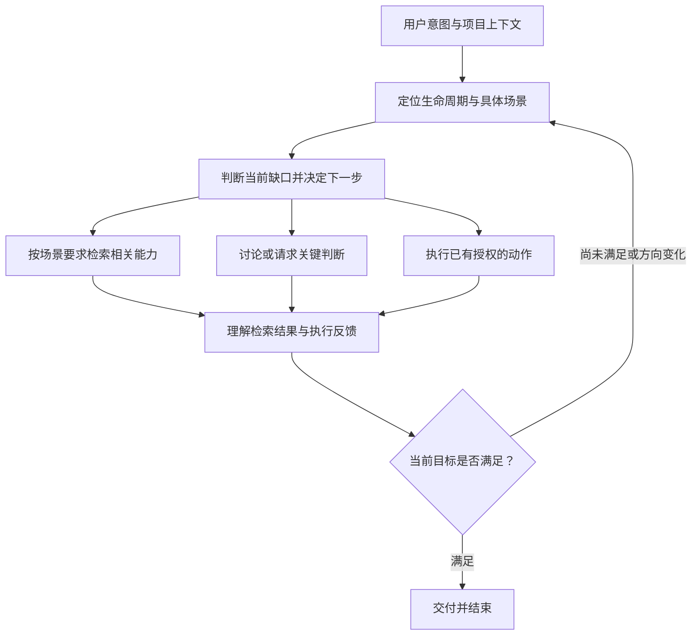

# Supermind

Supermind 是基于 Codex 的软件开发协作插件，实践一种面向 AI 时代的开发哲学：放大人与 AI 的价值，让协作方法随着 AI 的能力演进。

## 为什么需要 Supermind

AI 能承担越来越多开发工作，但完全自由的协作容易遗漏重要实践，固定流程又可能要求人去适应工具。Supermind 用贴合当前 AI 能力的范式弥补短板，而不把今天的方法当成永恒规则。

软件生命周期是共同坐标，具体场景规定进入条件、行动要求和能力检索时点。核心决策机制结合当前意图、项目事实和执行结果，决定下一步做什么、何时需要用户判断、何时结束。场景和能力可以扩展。意图和认识可以变化，讨论也不必总是以代码或决策结束。衡量它的标准是实际收益，而不是流程完成度或能力库规模。

## 核心能力

**核心决策与场景触发**：理解用户意图与项目上下文，定位生命周期和具体场景，判断当前缺口，选择动作，再依据执行反馈继续或结束。后端选型、本地运行、单机部署等场景在规定时点触发相关需求检索。

**基于情境的人机协作**：结合软件生命周期、当前意图和已有资料开展工作。AI 承担材料整理与常规执行，人参与价值取舍和关键判断，无需维护一套工作流。

**按需组织技能与工具**：根据当前问题选择规划、实现、调试、验证等方法，不机械套用工作流。Superpowers 和其他插件都是可选能力来源。

**把复用作为核心能力**：响应明确的复用要求，在有价值的时机评估复用，并从开发成果中发现值得抽象的候选。既关注代码，也关注工程实践；只有真实载体、通用边界与收益依据成立，且经人确认后才登记候选，每次具体复用也须确认。

## Supermind 如何作出决定

核心大脑以用户意图、项目事实和已有授权为依据，从生命周期中识别具体场景，判断当前缺少什么，再选择下一步动作。收到用户修正或执行反馈后，它会重新判断，直到当前目标得到满足。



生命周期覆盖**构想与需求、设计、实现、验证、交付、运行维护、退出**。它们是共同坐标，任务可以从任何阶段进入，也可以跨阶段推进；用户无需选择阶段或维护工作流。

具体场景规定检索时点，能力大类负责组织目录。例如：

| 场景 | 检索时点 | 相关需求 |
| --- | --- | --- |
| 新项目需要后端 | 确定实现基础之前 | 后端基础代码与配套实践，优先评估 Nova Go |
| 开发登录认证 | 自行设计实现之前 | 与实际身份、登录和会话要求匹配的能力 |
| 建立本地运行方式 | 新写进程管理脚本之前 | 应用启动、停止、重启等管理能力，包含 Nova CLI |
| 建立单机部署方式 | 新写部署方案或脚本之前 | 单机部署、远端进程和日志能力，包含 Nova CLI |

场景命中要求完成相关检索，采用哪项能力仍需结合实际需求判断。已有有效结果继续使用，重大冲突或新需求出现时再查询；已接入能力的日常使用不重复触发引入。Nova Go 与 Nova CLI 分别服务不同需求，独立触发。

这套机制通过技能入口、核心决策指引和场景指引驱动 AI，再调用现有技能与工具。它不包含宿主全局事件监听器。用户明确要求只讨论、只设计或自行验证时，Supermind 按该范围交付。

## 安装或更新

把下面这段提示词复制给能够操作本机 Codex 的 AI：

```text
请帮我在本机 Codex 中安装或更新 Supermind。

项目地址：https://github.com/luaxlou/supermind
插件标识：supermind@supermind

先检查现有安装和插件源：未安装则安装，已安装则更新到远端 main 的最新发布状态。
请阅读项目的最新安装说明，使用 Codex 官方插件命令，从上述远端仓库安装，不使用本地开发目录或直接修改技能文件。
保留现有配置和能力库数据，不更新其他插件；缺少依赖、权限或认证时明确说明，不把失败当作成功。
完成后核对插件已启用、安装来源及版本，并告诉我验证结果，以及是否需要新建 Codex 任务才能生效。
```

同一段提示词既适用于首次安装，也适用于后续更新。

## 如何使用

在任务中输入 `$supermind`，然后直接描述目标，例如：

> 用 Supermind 给这个产品增加手机号登录功能。

> 用 Supermind 查看能力库，评估是否已有适合当前项目的登录能力。

首次使用能力库时，需要指定或创建一个 GitHub 私有仓库，并完成 GitHub 命令行认证；后续由本地工具管理和增量同步。

Supermind 只进入软件开发相关工作；一般讨论和解释不要求先配置能力库。

## 进一步了解

[详细使用指南](docs/usage.md)

[开发哲学与设计边界](docs/product/supermind-decision-model.md)

[核心决策机制与 Mermaid 设计图](docs/product/2026-09-07-core-decision-mechanism-design.md)

[执行中的核心决策指引](plugins/supermind/skills/supermind/references/core-decision.md) · [生命周期与具体场景](plugins/supermind/skills/supermind/references/scenarios.md)
