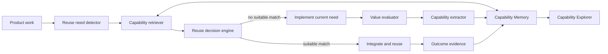

# Capability Memory design

Status: Approved
Date: 2026-09-04

## Purpose

Supermind must avoid rebuilding capabilities that already exist. During product work it will
proactively discover reusable work, evaluate its expected net value, extract it into the least
costly durable form, retrieve it in later designs, and learn from reuse outcomes.

This design introduces two related product capabilities:

- **Capability Memory** maintains an evidence-backed, cross-project capability index.
- **Capability Explorer** prints the index as human-readable categories, tables, detail cards, and
  Mermaid relationship diagrams.

The system is value-driven. Generality alone does not justify extraction or reuse.

## Goals

- Search for reusable capabilities before designing or implementing a reusable module.
- Build and maintain the index automatically without requiring user initialization.
- Retrieve across Chinese product intent and English code or technical documentation.
- Rank results by contract fit, evidence, expected benefit, integration cost, and maintenance risk.
- Accumulate verified reuse evidence and change capability maturity over time.
- Present the index and every reuse recommendation in a form humans can understand.
- Repair index infrastructure automatically and stop explicitly when repair cannot restore it.

## Non-goals

- Indexing every source file or traversing the user's entire disk.
- Copying complete private repositories into the capability store.
- Publishing, globally installing, or moving capability artifacts without authorization.
- Treating vector similarity as proof that a capability is safe or economical to reuse.
- Running a permanent background database service.

## Principles

### Value before abstraction

Use expected net value as the extraction and reuse gate:

```text
expected net value =
  expected reuse count * benefit per reuse
  - extraction cost
  - integration cost
  - verification cost
  - expected maintenance cost
  - failure and obsolescence risk
```

Benefits may be time saved, direct cost avoided, quality gained, or risk reduced. A broadly
applicable implementation that is unlikely to be reused should remain local.

### Evidence before recommendation

Semantic similarity identifies candidates; it does not select one. A recommendation must include
contract compatibility, current source availability, verification evidence, and a positive expected
net value. A capability becomes recommended only after at least one independent successful reuse.

### Complete retrieval or explicit stop

Failure to search is not evidence that no reusable capability exists. Supermind must automatically
repair missing or unhealthy index infrastructure. If repair cannot restore complete retrieval, it
must stop the affected design or implementation and report the blocking fault. There is no reduced
quality or silent bypass mode.

A runtime vector, FTS, or hybrid retrieval failure causes exactly one bounded generation rebuild,
candidate-generation evaluation, health validation, and complete hybrid retry. The system retains
both attempt diagnostics and blocks after the retry; generation-consistency retries never select
records from mutable authoritative state.

### Provider and artifact neutrality

A capability may be implemented as code, a template, a Skill, a plugin, a tool, an API, a dataset,
or a service. It may come from Codex, Superpowers, another plugin, a project, or Supermind itself.
Supermind selects the lowest-total-cost form that preserves the required contract.

## Architecture



### Reuse need detector

During design, identify modules whose stable purpose may recur across products, such as
authentication, authorization, payment, upload, notifications, observability, and release
automation. Produce a requirement profile containing intent, expected contract, constraints,
technology context, and quality requirements.

### Capability retriever

Run one retrieval operation combining:

- hierarchical category browsing;
- dense semantic similarity;
- BM25 keyword matching;
- metadata filters for stack, runtime, license, lifecycle, platform, and compatibility;
- relationship expansion for dependencies, alternatives, compositions, and known consumers.

Use reciprocal rank fusion to combine semantic and lexical candidates, then pass them to the reuse
decision engine. Retrieval must distinguish `no_match` from `search_failed`.

Eligibility and explicit contract rejection are applied before the final result limit. Search
results bind immutable capability snapshots and current source-availability decisions to the checked
generation. Local files are checked directly; non-local APIs and services require affirmative,
ordered source-availability evidence. Requirement profiles append exact `runtime`, `platform`, and
acceptable `license` filters. Existing serialized profiles remain valid when those arrays are absent.

### Reuse decision engine

Rerank candidates using:

```text
reuse score =
  requirement and contract fit
  + verified reliability
  + historical reuse benefit
  - integration and adaptation cost
  - maintenance and obsolescence risk
```

Return the selected action (`reuse`, `adapt`, or `build`) with candidate scores and a concise human
explanation. Do not select an invalid, stale, or unverified capability merely because it is
semantically close.

Workflow, Explorer, and CLI decision rendering call the same typed policy. Explicit polarity,
assignment, and version-range contradictions have zero contract fit and semantic similarity cannot
override them. Exact fit `1.0` is reserved for complete clause coverage; missing mandatory clauses
produce partial fit.

### Value evaluator and capability extractor

After the current implementation is verified, estimate its future net value. Register low-evidence
work as a candidate only when its expected value is positive. Extraction creates a stable contract,
selects the lowest-cost artifact form, records its source, and preserves verification evidence.

Writing an index entry is automatic. Moving code outside the current project, creating or installing
a global Skill or plugin, publishing, or uploading content remains approval-gated.

### Capability Explorer

Provide four textual views:

- a category overview with counts and maturity distribution;
- a filtered capability table;
- a capability detail card with contract, evidence, economics, and location;
- a Mermaid graph of dependencies, alternatives, compositions, and consumers.

By default, print only meaningful changes and reuse decisions. Print the complete catalog or graph
when the user asks to view, inspect, filter, or map the capability library.

## Storage and embedding

Use [LanceDB OSS](https://docs.lancedb.com/quickstart) as an embedded local store. It runs in the
Supermind process, accepts a local filesystem path, and requires no database service. LanceDB
provides vector search, BM25 full-text search, hybrid retrieval, metadata filtering, incremental
indexing, and table versioning. Relevant behavior is documented in its
[search guide](https://docs.lancedb.com/search),
[incremental indexing guide](https://docs.lancedb.com/indexing/reindexing), and
[versioning guide](https://docs.lancedb.com/tables/versioning).

Use [FastEmbed](https://qdrant.github.io/fastembed/) for local ONNX embedding inference. The initial
model is `sentence-transformers/paraphrase-multilingual-MiniLM-L12-v2`: a 384-dimensional,
Apache-2.0 multilingual model listed at approximately 0.22 GB in the
[FastEmbed model catalog](https://qdrant.github.io/fastembed/examples/Supported_Models/). Pin the
library and model revisions. A model change creates a new embedding generation and triggers a full
re-embedding before the new generation becomes active.

Store the database beneath the resolved Codex data home in a Supermind-owned directory. The runtime
must resolve the platform-specific Codex home without changing or repurposing the user's environment
variables. Capability artifacts remain at their source locations; the database stores their
structured records, searchable descriptions, embeddings, evidence, relationships, events, and
content hashes.

The plugin owns a daemonless Python runtime entry point and a pinned dependency manifest. On first
use it creates its managed environment, installs the pinned dependencies, downloads the pinned model,
creates the schema and indexes, validates health, and only then continues product work.

## Human-readable taxonomy

Each capability has exactly one primary category path and any number of facets. The stable top-level
categories are:

```text
Capability library
|-- Code and components
|   |-- Identity and access
|   |-- Frontend components
|   |-- Backend modules
|   |-- SDKs and libraries
|   `-- Infrastructure
|-- Product and business
|   |-- Business rules
|   |-- Domain models
|   |-- Product patterns
|   `-- User journeys
|-- Design and experience
|   |-- Design systems
|   |-- Interaction patterns
|   |-- Page templates
|   `-- Content and copy
|-- Engineering and methods
|   |-- Discovery and planning
|   |-- Debugging and diagnosis
|   |-- Testing and evaluation
|   |-- Release and operations
|   `-- Security and quality
|-- Tools and integrations
|   |-- Codex Skills
|   |-- Plugins and MCP
|   |-- External APIs
|   |-- Automation
|   `-- SaaS services
`-- Data and intelligence
    |-- Data models and schemas
    |-- Datasets
    |-- Prompts and agents
    |-- Embeddings and models
    `-- Evaluation sets
```

Supermind may add lower-level categories as the library grows, but it does not create new top-level
categories automatically. Facets express cross-cutting attributes without duplicating records in the
tree.

## Data model

### Capability

- stable identifier, name, summary, primary category path, and facets;
- problem signature, input/output contract, constraints, and visible failure behavior;
- artifact type, source URI, source revision, content hash, owner, and license;
- stack, runtime, platform, dependencies, compatibility range, and embedding generation;
- lifecycle state, confidence, created time, updated time, and last verified time.

### Evidence

- capability identifier and source project;
- evidence type: test, verification, reuse outcome, cost observation, or failure;
- observed result, measurement unit, confidence, timestamp, and supporting URI;
- integration effort, time or cost saved, quality change, and risk outcome when applicable.

### Relationship

- source and target capability identifiers;
- relationship type: dependency, alternative, composition, replacement, or consumer;
- compatibility constraints and supporting evidence.

### Event

- event type: discovered, evaluated, registered, extracted, reused, upgraded, invalidated, or retired;
- capability identifier, source context, timestamp, previous state, resulting state, and reason.

Embeddings are derived fields. Structured records and event history are sufficient to rebuild every
vector and search index.

Metadata-derived package, README, and Skill descriptions are credential-redacted before observation
hashing, storage, search-text construction, or embedding. Known credential formats and high-entropy
token-like values use one deterministic marker; original secrets are excluded from exposed errors,
evidence, events, and source-content hashes.

### Requirement observations and retrieval evaluation

A complete `build` decision writes an authoritative unmet `RequirementObservation` and event in the
same transaction. It is demand, not a positive Capability. A later current verified or recommended
implementation may link the observation, producing a second immutable demand event. The CLI exposes
read-only `list-demands` and explicit `link-demand` operations.

Every candidate derived-index generation is evaluated offline before activation against the bundled,
versioned retrieval dataset. Threshold metadata covers positive clauses, hard contradiction and
version negatives, and runtime/platform/license filters. A dataset fault or threshold regression is
a blocking health failure and leaves the previously active generation unchanged.

## Lifecycle

```text
observed -> candidate -> verified -> recommended
                 |          |             |
                 +----------+-------------+-> degraded -> retired
```

- **Observed** records a possible reusable need or artifact without claiming value.
- **Candidate** has a recognizable contract and positive expected net value.
- **Verified** has current implementation and verification evidence.
- **Recommended** has at least one independent successful reuse and remains compatible.
- **Degraded** has stale, conflicting, or failing evidence and is excluded from recommendations.
- **Retired** is intentionally no longer eligible for reuse but remains visible in history.

State transitions are evidence-driven and recorded as events.

## Default behavior

### Initialization

On the first Supermind task, automatically:

1. resolve and create the Supermind data directory;
2. provision the pinned local runtime and embedding model;
3. create or migrate the database schema;
4. establish the six top-level categories;
5. index capability descriptions from the current project and installed Skills and plugins;
6. run a health check before product work continues.

Do not traverse the entire user disk. A project becomes an indexed source when Supermind works in it
or when the user explicitly adds it.

### Product design

Before designing a reusable module, create a requirement profile and call `search`. If candidates are
found, print the best matches, selected action, and value rationale. If no candidate qualifies,
continue with a new implementation and retain the requirement as an observation.

### Verification and extraction

After implementation verification, call `evaluate`. Register a positive-value candidate and update
its evidence. Extract automatically only within the current project. Any cross-project mutation or
global installation remains approval-gated.

### Reuse feedback

After every reuse attempt, record success or failure, actual integration effort, observed savings,
and compatibility findings. Recompute maturity and recommendation score. Repeated failures or source
drift degrade the capability until it is reverified.

## Internal API

The orchestration layer calls a storage-independent interface:

```text
initialize()          create or migrate the capability library
discover(context)     identify and describe candidate capabilities
search(requirement)   retrieve and rank reusable capabilities
evaluate(candidate)   estimate net value and maturity
register(capability)  create or update a capability record
record_use(result)    append outcome evidence and update maturity
inspect(filter)       render category, table, detail, or relationship views
rebuild()             rebuild derived indexes from structured records
health_check()        validate runtime, model, storage, indexes, and sources
```

Every operation returns a typed result. `search` must return either a complete result or a distinct
failure; an empty match list cannot represent infrastructure failure.

## Recovery and blocking behavior

There are no degraded retrieval modes.

- Missing runtime or model: provision the pinned dependency or model, validate it, then continue.
- Missing or outdated schema: create or migrate it transactionally, then continue.
- Damaged vector or text index: rebuild it from structured records and activate it atomically.
- Concurrent writer: acquire the single-writer lock and retry within a bounded repair window.
- Moved or deleted source: invalidate affected records, refresh source metadata, and rerun retrieval.
- Unrecoverable failure: stop the affected design or implementation and report the failed invariant,
  repair attempts, affected paths, and the next actionable repair.

Readers use the last committed healthy generation while a new index generation is built, but an
outdated generation cannot be presented as a complete current search. Index activation requires a
successful health check.

## Privacy and authorization

Automatic global index maintenance is part of normal Supermind operation. Store capability summaries,
contracts, evidence, hashes, and source locations by default. Exclude detected secrets and do not
copy complete repositories into the database.

Require explicit authorization before:

- moving or writing code outside the current project;
- creating or installing a global Skill or plugin;
- publishing a capability;
- uploading indexed content to a third-party or cloud service.

## Verification

### Unit coverage

- taxonomy validation and primary-category invariants;
- lifecycle transitions and evidence requirements;
- net-value calculations and reuse scoring;
- distinction between `no_match` and `search_failed`;
- rendering of category, table, detail, and Mermaid views;
- secret exclusion and source-hash invalidation.

### Integration coverage

- first-use runtime, model, schema, and index provisioning in an empty temporary Codex home;
- LanceDB insert, update, delete, version, hybrid query, metadata filter, and rebuild behavior;
- multilingual retrieval from Chinese intent to English capability descriptions;
- atomic generation activation and concurrent writer serialization;
- schema and embedding-generation migration without record loss;
- forced corruption followed by successful repair;
- forced unrecoverable repair followed by an explicit blocked result.

### End-to-end acceptance scenario

1. Start with an empty Capability Memory.
2. Build and verify a login module in one project.
3. Register it as a candidate with its contract and evidence.
4. Reuse it successfully in an independent project and promote it to recommended.
5. In a third project, retrieve it from a Chinese login requirement, print its category and rationale,
   and select it over incompatible alternatives.
6. Change or remove its source and verify that it is no longer recommended.
7. Damage the index, automatically rebuild it, and repeat the complete search.
8. Make repair impossible and verify that Supermind stops rather than reimplementing login.

### Retrieval quality gate

Maintain a versioned evaluation set of representative capability requirements, relevant matches,
hard negatives, and expected filters. A library or model upgrade cannot become active unless it
preserves all safety and lifecycle invariants and meets or exceeds the current retrieval-quality
threshold.

## Success criteria

- A new user receives a healthy, searchable local capability library without initialization steps.
- Every reusable-module design performs a complete capability search before implementation.
- Every recommendation is traceable to contract, evidence, economics, and source state.
- Reuse outcomes change future rankings and lifecycle state.
- Humans can understand the library through stable categories and textual visualizations.
- Infrastructure failure is repaired or explicitly blocks work; it never masquerades as no match.
