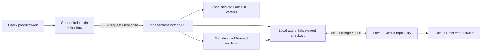

# Distributed Capability Memory design

Status: Approved

Implementation status: Local implementation and automated acceptance verified on 2026-09-07.
The independent 0.2.0 CLI, pinned plugin bootstrap, distributed event synchronization, and
categorized collapsible README are implemented. A copy of the real embedded library exported
equivalently with 250 capabilities; the original store was retained. Real private GitHub cutover
remains pending the user's repository selection. This design is not marked fully implemented
until that external cutover is verified.
Date: 2026-09-06
Builds on: `docs/product/2026-09-04-capability-memory-design.md`

This document replaces the earlier design's plugin-owned runtime, local-only storage, and textual
Explorer delivery decisions. Its value model, taxonomy, retrieval, evidence, and fail-closed
hardening rules remain in force unless this document explicitly changes their boundary.

## Decision

Capability Memory becomes an independent, daemonless Python CLI. Supermind accesses it through a
stable JSON command interface instead of owning the memory implementation inside the plugin.

The memory remains local-first. A user-selected private GitHub repository acts as a distributed Git
remote for immutable, structured memory events and generated Markdown views. GitHub is not a
central database and is not required to answer a search from an already healthy local copy.

The repository root `README.md` is the primary human browser. It renders the complete capability
library as a categorized, nested, collapsible index using GitHub-native `<details>` and `<summary>`
elements. Detail Markdown pages and Mermaid diagrams provide deeper inspection. The product runs no
permanent web service, opens no local port, publishes no GitHub Pages site, and generates no custom
HTML application.

## Outcome

After one initialization, Supermind can:

- search and update the capability library through the independent CLI;
- accumulate reusable knowledge while product work proceeds;
- synchronize incremental changes between a user's computers through a private GitHub repository;
- reconstruct every authoritative memory record from immutable events;
- rebuild the local vector and keyword indexes without downloading another machine's derived data;
- open a readable, current capability browser directly on the GitHub repository homepage; and
- expose synchronization, conflict, corruption, or retrieval failure explicitly, without a reduced
  quality fallback.

## Goals

- Separate the reusable memory product from the Supermind plugin lifecycle.
- Make every mutation local, durable, auditable, and incrementally synchronizable.
- Support connecting an existing private repository or creating a new private repository during
  plugin initialization.
- Preserve the existing complete hybrid retrieval and evidence-backed reuse policy.
- Make the library understandable to a person without requiring CLI output or knowledge of vector
  databases.
- Make deterministic recovery possible from the private Git repository alone, except for source
  artifacts that deliberately remain in their original locations.
- Avoid persistent processes and central infrastructure.

## Non-goals

- Synchronizing LanceDB files, embeddings, full-text indexes, model weights, Python environments,
  locks, caches, credentials, or source repositories.
- Providing a multi-user hosted database, collaboration server, or permission system beyond the
  selected GitHub repository's access controls.
- Editing authoritative records or generated Markdown directly in the GitHub web interface.
- Encrypting repository files while also expecting GitHub to render their content.
- Supporting a degraded lexical-only, vector-only, stale-generation, or embedded-plugin fallback.
- Treating generated Markdown as an authoritative source of memory data.

## System boundary



Only the Python CLI may create memory events, materialize state, rebuild indexes, or generate the
browser. The plugin detects reuse needs, prepares requirements, and consumes CLI results. It does
not write event files or database tables itself.

The CLI is process-based, invoked when needed, and exits after each command. There is no daemon,
HTTP API, local server, or listening socket.

## Initialization

When Supermind first needs Capability Memory, the plugin locates the independent CLI and invokes its
machine-readable status command. If the CLI is not configured, the plugin asks the user to choose
one of two initialization paths:

1. connect an existing private GitHub repository; or
2. create a new private repository, named `supermind-memory` by default.

For an existing repository, initialization must prove that:

- the authenticated GitHub identity can read and write it;
- GitHub reports the repository as private;
- the repository is empty or contains a compatible Supermind memory marker and supported schema;
- the configured branch and remote resolve unambiguously; and
- the local checkout is not an unrelated or dirty Git worktree.

For automatic creation, the CLI uses the user's existing GitHub CLI or Git credentials to create a
private repository, verifies the resulting visibility, initializes the repository marker and first
event set, and pushes the first commit. It never accepts a successful creation response as proof of
privacy without reading the resulting repository metadata.

Authentication remains owned by GitHub CLI, the Git credential helper, or the SSH agent. Supermind
does not request, copy, log, or persist a GitHub token.

After connection, the CLI clones or attaches the remote to a Supermind-owned local checkout, fetches
all supported event files, validates them, replays authoritative state, builds the local indexes,
renders the browser, and reports health. Initialization succeeds only when repository validation,
replay, retrieval health, and rendered-output validation all pass.

## Repository format

```text
README.md
memory.json
schemas/
  v1/
    event.schema.json
    memory.schema.json
events/
  v1/
    <device-id>/
      <yyyy-mm>/
        <event-id>.json
catalog/
  README.md
  code-and-components.md
  product-and-business.md
  design-and-experience.md
  engineering-and-methods.md
  tools-and-integrations.md
  data-and-intelligence.md
capabilities/
  <capability-id>.md
demands/
  open.md
  resolved.md
relationships.md
.supermind/
  render-manifest.json
```

`memory.json` is the repository marker. It records the repository format version, authoritative
event schema versions, renderer version, default branch, and repository identifier. It contains no
credentials or machine-specific paths.

The `events/` tree is authoritative. Every other memory view is derived. Generated Markdown is
committed because it is the human-facing browser; the render manifest binds it to an authoritative
event-set digest so stale or hand-edited output is detectable.

The directory layout deliberately partitions event files by device and month. Independent devices
normally create different paths, allowing ordinary Git merges without both devices editing one
append-only log file.

## Authoritative event model

Every mutation creates one immutable canonical JSON event. Required fields are:

```text
schema_version
event_id
device_id
entity_type
entity_id
operation
parent_event_ids
occurred_at
payload
content_hash
```

- `event_id` is globally unique and independent of wall-clock ordering.
- `device_id` is a generated non-secret identifier for one CLI installation.
- `entity_type` identifies capability, evidence, relationship, demand, reuse outcome, or supported
  metadata.
- `parent_event_ids` identifies the exact entity revision on which the mutation was based.
- `occurred_at` is normalized UTC metadata, not the conflict-resolution authority.
- `payload` is schema-validated and sanitized before persistence.
- `content_hash` is computed from canonical, sanitized event content.

Event files are never changed after commit. Retirement and deletion are represented by explicit
tombstone events. Identical event IDs with identical hashes are deduplicated. Identical event IDs
with different hashes are corruption and block synchronization.

Replay order is deterministic and does not depend on Git commit time or filesystem traversal. The
replayer constructs the parent graph, verifies all reachable parents, applies a defined event-type
precedence only where the schema permits it, and produces the same materialized state and digest on
every machine.

Concurrent mutations to different entities merge automatically. Concurrent mutations to the same
entity from the same parent produce an explicit unresolved conflict record. The CLI does not use
last-writer-wins, timestamp wins, or silent field merging. Searches may continue against the last
healthy materialization, but a conflicting entity is not recommended for new reuse until the user
resolves the conflict through a new CLI event.

## Local derived store

LanceDB, FastEmbed, the pinned multilingual model, FTS data, fused-search generations, evaluation
manifests, and activation metadata remain local derived state. They are rebuilt from replayed
authoritative records and current source-availability checks.

The repository does not contain:

- LanceDB table files or transaction metadata;
- embedding vectors or vector-index files;
- model weights or runtime dependencies;
- lock files, temporary files, logs, or health snapshots;
- GitHub credentials; or
- copied reusable artifacts from source projects.

This keeps Git history reviewable and avoids binary index conflicts. A model or index implementation
change creates a new local generation; it does not rewrite authoritative events.

## Mutation and synchronization transaction

Every mutating CLI command uses the same transaction boundary:

1. acquire the local memory lock;
2. fetch the configured remote branch when it is reachable and record the checked remote head;
3. validate the repository marker, schemas, event identities, hashes, and remote commit ancestry;
4. merge the union of immutable event paths;
5. replay and reject corruption or unresolved prerequisites;
6. create and validate the requested local event;
7. replay the resulting event set and update the local materialized state;
8. rebuild or incrementally update the affected search generation;
9. render all impacted Markdown and Mermaid views;
10. validate links, escaping, category membership, counts, and the render-manifest digest;
11. create one Git commit containing the event and its derived browser changes; and
12. push the commit.

If the push is rejected as non-fast-forward, the CLI fetches, performs the immutable-event merge,
revalidates, rerenders, recommits when necessary, and retries a bounded number of times. Exhaustion
returns a structured synchronization failure. It never force-pushes or rewrites remote history.

The CLI distinguishes two durable results:

- `committed`: the event and generated views are durable in the local Git checkout; and
- `synced`: the containing commit is present on the configured GitHub branch.

When GitHub is temporarily unavailable, a command may create a local commit from a healthy,
previously initialized checkout and returns `pending_sync` instead of claiming synchronization.
The healthy local library remains searchable and writable. The next online command synchronizes
pending commits before publishing any new commit. A later remote divergence is processed through
the same immutable-event merge and explicit conflict rules. This is offline continuation of the
same full capability, not a reduced retrieval strategy: search quality and correctness gates remain
intact, while cross-device freshness is explicitly reported as pending.

Corruption, unsupported schema, privacy loss, unresolved event conflict affecting a candidate, or
an unhealthy local retrieval generation blocks the affected operation. There is no alternate
embedded memory or weaker search path.

## GitHub-native capability browser

The repository root `README.md` is generated as a compact, collapsible catalog. A person should be
able to understand the library without opening raw JSON or learning CLI commands.

The stable top-level taxonomy remains:

1. Code and components
2. Product and business
3. Design and experience
4. Engineering and methods
5. Tools and integrations
6. Data and intelligence

Each category is a top-level `<details>` block. Its `<summary>` shows the human label, capability
count, maturity distribution, and one-line value statement. Each capability inside it is a nested
`<details>` block whose summary shows the name, maturity, availability, and concise purpose.

Example generated structure:

```html
<details>
<summary>代码与组件 · 8 项 · 3 项已验证</summary>

用于直接复用到产品实现中的模块、组件和库。

<details>
<summary>登录与身份服务 · 推荐复用 · 当前可用</summary>

- 解决什么：统一手机号身份和登录会话。
- 适合什么：需要手机号登录的移动端产品。
- 复用依据：2 次成功验证，1 次独立项目复用。
- 来源：私有项目中的已验证实现。
- [打开完整能力卡](capabilities/example-login.md)

</details>
</details>
```

Raw similarity scores and internal identifiers are not the primary labels. They may appear in a
detail page when needed for diagnosis. Tools and integrations are collapsed by default so observed
tool inventory does not overwhelm verified reusable product capabilities.

The root page also contains:

- library freshness and synchronization status;
- open reuse demands that still have no implementation;
- recently added, verified, reused, retired, or conflicted capabilities;
- links to category pages and complete capability cards; and
- a compact Mermaid relationship overview.

Category pages use the same foldable pattern for larger collections. A capability detail page shows
its purpose, contract, constraints, lifecycle, source, verification evidence, reuse outcomes,
economics, dependencies, alternatives, consumers, unresolved conflicts, and related demands in
human language.

`relationships.md` contains Mermaid diagrams for dependencies, alternatives, compositions, reuse
consumers, and demand-to-implementation links. Labels and node text are escaped and bounded so
stored content cannot inject arbitrary HTML or break the document.

Generated Markdown is never parsed back into authoritative state. The CLI refuses to commit or push
when generated files do not match the current renderer and event-set digest. Direct edits are
overwritten by the next successful render and reported as derived-output drift.

The `open` command synchronizes, rerenders if necessary, verifies the manifest, and opens the
configured private repository URL in the user's browser. It may use `gh repo view --web` or the
operating system's URL opener; it does not start a server.

## CLI contract

The executable is independently versioned and exposes a stable machine-readable interface. Initial
commands include:

```text
supermind-memory init --repo <owner/repository> --format json
supermind-memory init --create-private [--name supermind-memory] --format json
supermind-memory status --format json
supermind-memory health --format json
supermind-memory sync --format json
supermind-memory rebuild --format json
supermind-memory open --format json
supermind-memory search --input <json> --format json
supermind-memory register --input <json> --format json
supermind-memory record-outcome --input <json> --format json
supermind-memory render --format json
```

Existing workflow-specific operations, including design search, demand observation, demand linking,
discovery, inspection, and relationship rendering, remain available through equivalent versioned
commands.

Input is passed as validated JSON files or standard input, never interpolated into a shell command.
Responses contain a schema version, operation ID, local generation, event-set digest, sync state,
structured result, and redacted diagnostics. Exit codes distinguish invalid input, configuration,
retrieval health, event conflict, repository corruption, authentication, and pending synchronization.

The plugin pins a compatible CLI protocol range. A missing CLI, incompatible protocol, or unhealthy
CLI is a blocking initialization error. The plugin does not fall back to its prior embedded
implementation.

## Privacy and trust boundary

GitHub must receive readable Markdown in order to act as the browser. Version 1 therefore stores
sanitized plaintext structured events and generated Markdown in a private repository. Repository
privacy and GitHub access control are mandatory; client-side encryption of those files is outside
this version because it would prevent GitHub rendering and repository search.

The existing sanitizer runs before event IDs, hashes, embeddings, commits, Markdown, logs, or CLI
responses are created. Secrets, authorization headers, private keys, tokens, passwords, sensitive
URI parameters, and machine-only paths are forbidden from synchronized payloads. Sanitization is
deterministic so independently rendered repositories remain stable.

Remote event and Markdown content are untrusted input. The CLI applies schema validation, size and
depth limits, canonical JSON validation, hash verification, path containment, symlink rejection,
Markdown/HTML escaping, and Mermaid label escaping before replay or rendering. The repository marker
and configured repository identity prevent accidentally attaching an unrelated private repository.

If the repository becomes public, loses required write access, changes identity unexpectedly, or
contains unsupported authoritative data, mutating commands stop before producing a commit.

## Migration and self-bootstrap

The current embedded Capability Memory is the first source used to bootstrap the independent tool.
Migration is an explicit, journaled operation:

1. open and fully validate the existing authoritative tables and demand history;
2. export every capability, evidence record, relationship, observation, outcome, and historical
   authoritative event into the new event schema without inventing missing evidence;
3. preserve stable entity identifiers and source revisions;
4. replay the exported events into a fresh materialized state;
5. compare entity row sets, lifecycle states, relationships, demand links, and content digests with
   the validated source;
6. run complete hybrid retrieval and known design-search equivalence checks;
7. render and validate the foldable README, detail pages, and relationship diagrams;
8. commit and push the initial repository state; and
9. switch the plugin to the independent CLI only after all validation passes.

The old store remains untouched until cutover evidence is complete. If export, replay, retrieval,
rendering, commit, or push fails, migration stops and reports the failed phase. Retrying resumes from
the journal or restarts from the still-valid source. Once cutover succeeds, the plugin has one
writer—the independent CLI—and does not dual-write or fall back to the embedded store.

This migration is also Supermind's self-bootstrap: its own verified Capability Memory capability,
hardening evidence, observed tools, reuse outcomes, and unresolved demands become the first content
of the distributed library.

## Failure handling

| Condition | Required result |
| --- | --- |
| GitHub unavailable after prior successful initialization | Commit against the healthy local event set, return `pending_sync`, and reconcile on the next online command. |
| Non-fast-forward push | Fetch, immutable-event merge, validate, rerender, and retry without force push. |
| Same-entity concurrent change | Record an explicit conflict; never silently choose a winner. |
| Invalid event, hash, parent, or schema | Quarantine diagnostics locally and block replay/sync. |
| Repository no longer private | Block mutation and report the visibility violation. |
| Stale or edited generated Markdown | Regenerate from events and require a matching manifest before commit. |
| Unhealthy vector, FTS, or hybrid route | Apply the existing bounded repair policy, then block if still unhealthy. |
| Missing or incompatible CLI | Block Supermind memory operations; no embedded fallback. |

## Verification

Implementation must provide automated evidence for:

- creating a private repository and connecting a compatible existing private repository;
- rejecting public, unrelated, inaccessible, malformed, or dirty repository targets;
- token-free authentication handling and persistence redaction;
- deterministic event canonicalization, hashing, replay, tombstones, and duplicate detection;
- two-device concurrent changes to different entities merging automatically;
- two-device changes to the same entity producing an explicit conflict;
- non-fast-forward retry without force push or history rewrite;
- offline `pending_sync`, subsequent synchronization, and cross-device hydration;
- rebuilding equivalent LanceDB, vector, FTS, and hybrid generations from events;
- migration row-set, demand-history, relationship, and retrieval equivalence;
- foldable root README rendering by category and nested capability;
- correct counts, human labels, deep links, escaping, and Mermaid output;
- detection and repair of stale generated Markdown;
- plugin-to-CLI JSON protocol compatibility and injection resistance;
- absence of a daemon, HTTP listener, local port, or GitHub Pages dependency; and
- the existing full Capability Memory hardening and release verification suite.

Acceptance requires a clean bootstrap from the current real library into a private test repository,
a second-machine checkout that rebuilds an equivalent healthy search index, and successful display
of the complete categorized library directly in the GitHub root README.

## Delivery sequence

1. Define and test the event schemas, canonicalization, replay, conflicts, and exporter.
2. Extract the Python package and CLI while preserving the existing local retrieval contract.
3. Implement private-repository initialization and incremental Git synchronization.
4. Implement deterministic Markdown, nested README folding, Mermaid rendering, and `open`.
5. Migrate the current real memory, validate equivalence, and publish the initial private repository.
6. Change the plugin to the versioned CLI protocol and remove its embedded write path.
7. Run cross-device, failure, security, migration, retrieval, and release acceptance tests before
   declaring cutover complete.

## Review decisions

Approval of this design confirms these product choices:

- local-first commits may exist temporarily as an explicit `pending_sync` state when a push fails;
- synchronized content is sanitized plaintext in a mandatory private repository so GitHub can render
  the browser;
- the generated, collapsible root README is the default browser, not a custom web application;
- event JSON is authoritative while Markdown and local search indexes are derived; and
- after verified migration, the independent Python CLI is the only memory implementation available
  to Supermind.
