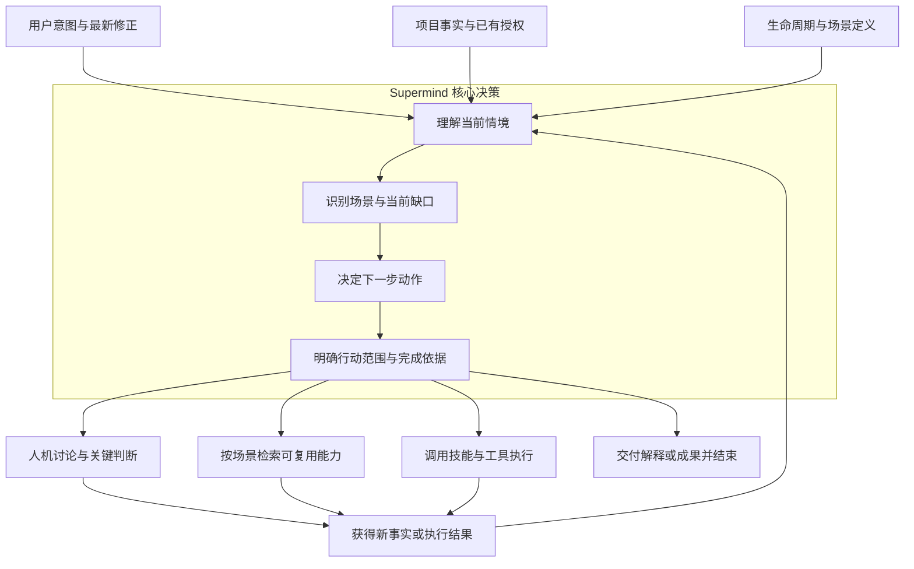
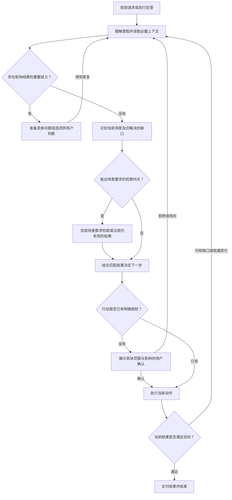
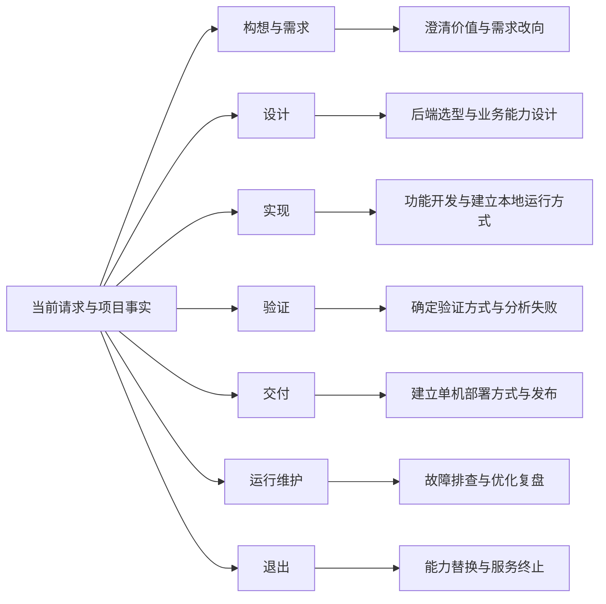
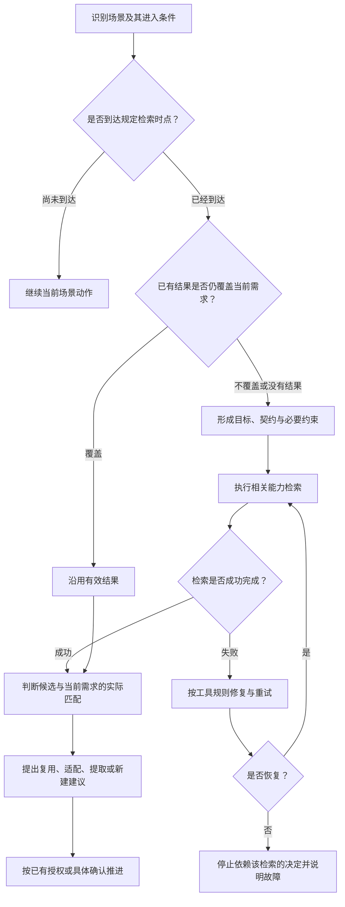
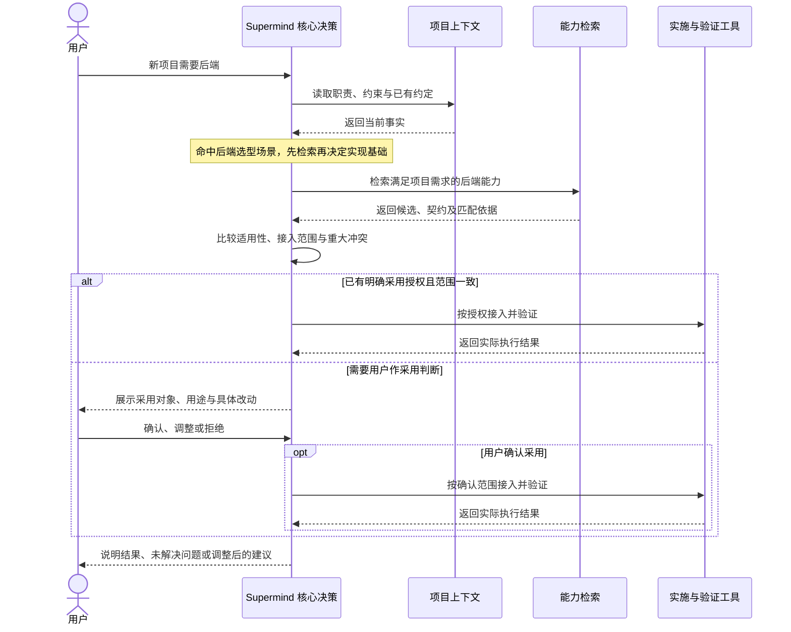
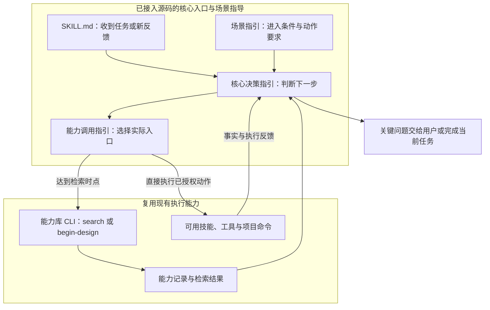

# Supermind 核心决策机制设计

> 历史记录：本文的独立 Agent、需求分析与设计职责已于 2026-09-09 被[当前定位与工程边界](supermind-decision-model.md)替代，不作为现行执行指引。

本设计已通过技能入口、核心决策指引和场景指引接入源码。场景识别由 AI 按技能执行，能力检索使用现有 CLI；未新增宿主全局拦截器。按用户要求未运行验证，实际行为由用户人工检查。

## 目标与职责

Supermind 的核心大脑根据用户意图、项目上下文、生命周期、当前场景和执行结果，决定下一步做什么、为什么做、怎样与用户协作、需要哪些能力，以及何时继续、调整或结束。

生命周期提供观察项目的坐标；场景提供具体行动的触发条件；决策机制选择当前动作；技能、工具与能力库支撑执行。能力复用是决策机制中的一个动作。

用户无需选择阶段或记忆场景名称。AI 主动读取相关材料并识别场景，对影响结果的重要歧义进行澄清。用户的新判断可以改变目标和方向，不能用旧计划压过当前意图。

### 图一：核心大脑在 Supermind 中的位置

图中的每条输出都是一种可选动作。核心大脑根据当前缺口选择动作，不要求先检索、再讨论、再执行。只有抵达场景规定的检索时点，检索才成为依赖它的下一步决定的前置要求。

生命周期和场景定义提供决策依据；能力库提供可选择的已有成果；技能与工具完成专业工作。核心大脑负责把这些部分与当前用户目标连接起来，并根据结果重新判断。解释清楚一个问题、完成一次取舍或确认暂不实施，也可以结束当前工作。

## 决策依据与结果

| 决策依据 | 需要理解什么 |
| --- | --- |
| 用户意图 | 当前要解决的问题、期望结果、最新修正与已有授权 |
| 项目上下文 | 已有产品定位、业务与技术边界、实际实现、运行环境与约束 |
| 生命周期 | 当前工作涉及哪些阶段；以受影响的工作为单位，不给整个项目贴单一阶段标签 |
| 当前场景 | 发生了什么具体事件，满足什么进入条件，需要解决什么判断 |
| 执行反馈 | 已取得的结果和证据、缺失信息、新发现的问题、此前决定是否仍成立 |

一次判断形成一个可执行的下一步：场景、近期目标、行动、必要能力、已有或所缺授权、完成依据。只向用户说明影响判断的依据和选择，不输出内部推理链，也不要求维护决策表单。

## 决策循环

1. 理解当前请求及最新修正，先判断工作是否属于 Supermind 的软件项目范围。
2. 读取与当前问题有关的上下文，定位受影响的生命周期和具体场景。
3. 判断当前缺少的是意图、事实、方案、可用能力、实施结果还是验证证据。
4. 选择下一步：解释或讨论、澄清、调查、检索、比较、设计、实施、验证、交付、复盘或结束。
5. 进入场景规定的检索时点时，形成具体需求并完成检索；结果出来之前不作出依赖该检索的选型或新建决定。
6. 结合当前授权执行；真正需要用户作价值取舍或扩大范围时，提供具体内容供判断。
7. 将实际结果与当前目标比较。结果足够则结束，需要补充则继续，依据变化则重新判断。

循环允许跨阶段、回到已有判断或转向新问题。不要求每次任务走完生命周期，也不要求一个场景只有一条固定路径。

### 图二：一次实际决策如何推进

“执行当前动作”可以是研究、解释、设计、实施或验证，不等同于写代码。AI 不需要把整张图逐项报告给用户；应只报告当前判断、必要依据、实际动作和结果。确认也不因循环重入而失效，只有缺少授权或范围实质变化时才进入确认分支。

## 生命周期与首批场景

下表的检索时点属于场景执行要求。未命中具体条件时，不因阶段名称或一句关键词启动检索。

### 图三：生命周期如何连接具体场景

图中七个阶段并列，是因为入口可以来自任何阶段。同一个请求可以涉及多个场景，例如“新建后端并发布到服务器”同时涉及后端选型、实现和部署；AI 依据真实依赖安排动作。不能因为图上存在某个阶段，就为当前任务补做该阶段的所有工作。

| 生命周期 | 场景与进入条件 | AI 当前动作与期望结果 | 能力检索时点与范围 | 用户决策点 |
| --- | --- | --- | --- | --- |
| 构想与需求 | 提出新软件想法，尚未明确用户价值 | 理解对象、问题、替代方式和收益，形成可讨论的问题定义 | 开始比较可复用产品机制时，检索对应机制；仅讨论想法不查库 | 是否值得做、首要服务谁 |
| 构想与需求 | 新增需求或改变现有行为 | 对照现有基线，明确变化、边界与验收结果 | 准备选择通用业务机制时，检索匹配规则和能力 | 价值、范围或既有约定出现实质变化 |
| 构想与需求 | 需求冲突或目标改向 | 识别冲突和影响，形成取舍或新的近期目标 | 新方向涉及能力选型时，检索新需求，旧结果不直接沿用 | 对冲突作取舍 |
| 设计 | 新项目明确需要后端 | 判断后端职责，提出实现基础和接入范围 | 后端技术选型前检索基础代码与实践；按已确认偏好优先考虑 Nova Go | 是否采用、接入范围 |
| 设计 | 设计登录认证等可复用功能 | 明确身份、会话、权限或其他具体契约 | 设计实现方案前检索对应功能；不能只查询“代码”大类 | 业务规则或采用范围的取舍 |
| 设计 | 设计页面与交互 | 理解用户任务、信息结构与交互边界，形成可评审方案 | 选择重复交互模式前检索设计能力；已有有效设计基线先复用其依据 | 对显著不同的体验方案作选择 |
| 设计 | 设计数据、外部接入或模型应用 | 明确输入输出、所有权和必要约束 | 确定方案前检索相应数据、集成或模型能力，类别可跨越多个大类 | 实质性成本、业务或权限边界 |
| 实现 | 按已确认方案开发或适配 | 完成当前范围并保持与方案一致 | 若设计阶段已有有效检索，沿用结果；新出现独立能力需求时再次检索 | 新发现使原采用范围实质改变 |
| 实现 | 建立或调整本地应用运行方式 | 明确应用、启动入口和接管范围 | 编写进程管理脚本前检索本地应用管理能力，包含 Nova CLI | 是否接管及替换哪些入口 |
| 实现 | 执行局部修复或直接修改 | 理解期望行为与影响，实施必要变更 | 纯文案或已有能力内的小修改直接处理；修复需要新增通用能力时检索 | 超出既有授权的范围变化 |
| 验证 | 实施完成，准备判断是否达标 | 比较验收要求、已有证据和缺口，补齐必要验证 | 建立或改变验证方式前检索验证能力；已有有效方式与证据继续使用 | 验收要求本身出现取舍 |
| 验证 | 检查失败、结果矛盾或证据不足 | 识别失败原因和证明缺口，形成有针对性的下一步 | 需要新的诊断或验证能力时先检索 | 无法同时满足原目标与约束 |
| 交付 | 建立或调整单机部署方式 | 明确应用、目标服务器、部署与运行边界 | 编写部署方案或脚本前检索单机部署、进程和日志能力，包含 Nova CLI | 采用范围和目标环境 |
| 交付 | 按既有方式发布成果 | 核实交付内容及授权，按已确认路径发布并核验 | 正常发布沿用已采用能力；发布方式改变时检索 | 尚未获得的发布授权或重大影响 |
| 运行维护 | 发生故障或运行异常 | 收集事实、定位影响和原因，恢复预期行为 | 需要引入诊断、监测或恢复能力时先检索；不阻断已授权的直接排查 | 重大运行影响及不可逆处理 |
| 运行维护 | 性能、成本或体验出现优化需求 | 建立问题证据，比较方案并验证收益 | 选择新的通用优化方法或工具前检索 | 收益与成本、行为之间的取舍 |
| 运行维护 | 完成复盘或发现反复出现的问题 | 判断是否值得沉淀，描述真实能力与适用场景 | 建议新增库条目前检索已有能力，判断更新或新增 | 是否收录及其完整触发场景 |
| 退出 | 替换或停止使用某项能力 | 确认依赖、影响和退出结果，制定必要调整 | 选择替代能力前检索；单纯讨论退出影响无需检索 | 替代方案、数据处置及停用范围 |
| 退出 | 终止服务或项目 | 明确使用方、保留责任和结束条件 | 存在具体迁移或归档能力需求时检索 | 服务终止及不可逆处置 |

Nova Go 和 Nova CLI 分别验证后端选型、本地运行、单机部署三个场景。具体工具是检索候选，不是场景定义本身；未来增加能力无需重新定义生命周期。

## 严格触发与按情境决策

严格性体现在：场景进入条件成立、抵达规定判断点时，必须完成对应动作。灵活性体现在：AI 根据上下文识别场景、组织必要动作和解释执行结果。

- 生命周期或大类不能单独作为检索请求。请求必须说明当前场景、要完成的事和必要契约。
- 场景检索以需求为中心，不只按工具名称查找，也不把单一类别变成排除相关能力的硬限制。
- 多场景同时出现时分别判断；例如同一项目需要后端与单机部署，两项检索需求独立，不强制绑定候选。
- 同一目标、范围与约束下已有有效检索结果时，继续使用；真正的新需求或重大冲突使原依据失效时再检索。
- 没有匹配结果、工具故障和事实不足是不同情况。故障阻断依赖其结果的决定，不能伪装成“无能力可用”；不相关工作可以继续。
- 不固定来源版本，不因版本变化单独索取确认。AI 判断现实兼容性，发现重大冲突时说明影响并处理。
- 未覆盖的新场景由 AI 根据当前目的明确其进入条件和所需动作；不能只因目录没有条目就跳过已满足的检索条件。值得长期复用的场景再纳入场景设计。

### 图四：场景如何明确触发能力检索

检索失败的修复次数仍由现有工具协议限定，图中的重试箭头不表示无限循环。无匹配结果属于成功检索后的判断，不能与故障混为一谈。候选符合分类或名字熟悉，不足以直接决定采用。

场景定义至少要能回答下列问题。它们是 AI 执行依据，不要求用户逐项填表。

| 场景内容 | 后端选型示例 | 本地运行方式示例 |
| --- | --- | --- |
| 进入条件 | 新项目已明确需要后端，正在选择实现基础 | 项目需要建立或调整一个或多个应用的运行入口 |
| 需要的上下文 | 后端职责、现有技术约束、数据与外部接入需要 | 应用列表、实际启动命令、环境、需保留的现有入口 |
| 检索时点 | 确定后端基础与开始重复实现之前 | 编写新的进程管理脚本之前 |
| 检索需求 | 满足项目职责的后端基础代码及配套实践 | 管理这些应用的本地启动、停止、重启等生命周期 |
| 候选判断 | 优先评估 Nova Go，核对具体适用性与接入影响 | 评估 Nova CLI，核对实际进程和配置条件 |
| 形成的结果 | 可供确认的采用范围，或有依据的其他选择 | 可供确认的运行管理方式与入口调整 |
| 不重复触发 | 已采用基础上的普通业务开发 | 已采用运行方式下的日常启动操作 |

在这两项场景中，进入条件决定是否考虑检索，检索需求决定查什么，候选判断决定能否采用。Nova Go 或 Nova CLI 的名字都不承担触发器职责。

## 人机协作

AI 承担读取资料、识别情境、寻找能力、准备可判断方案、执行和验证。用户承担目标价值、重要范围和关键取舍。已有授权持续有效，不因阶段切换或方案细节变化重复询问。

场景命中触发检索，不自动授权采用。需要确认时，必须展示用途、触发、采用对象和具体调整，不能只问“是否继续”。用户明确要求只讨论或只设计时，交付相应成果，不自动实施。

### 图五：一次后端选型中的人机与工具分工

用户的回答可以结束选型，也可以改变需求。工具只能提供查询或执行结果，不能替用户扩大授权；核心大脑必须在收到结果后继续作出判断，不能把工具“成功返回”直接等同于目标完成。

## 落地范围与真实能力边界

本次在现有生命周期、协作原则和检索入口之上落实以下连接：

1. 技能入口先定位场景并作下一步判断，替换仅以“稳定模块设计前”描述检索时点的入口说明。
2. 以独立场景指引维护进入条件、所需上下文、动作、检索需求和完成依据，由核心入口引用，避免在多份说明中重复维护。
3. 检索入口接收明确的场景与需求上下文，将其传给已有检索能力；复用结果继续依据真实匹配与授权决定，不由场景直接绑定某个工具。
4. 能力收录同时描述它能服务的场景，供场景需求检索匹配；大类保留目录组织作用。
5. 以实际协作案例验证“命中场景确实检索、已覆盖情境不重复检索、不适用情境不误触发”。

技能指导负责 AI 的识别与行动要求，CLI 负责被调用边界内的检索执行与故障处理。当前宿主未提供本项目可控制的每轮强制拦截器，不能把指导规则宣称为已实现的全局自动侦测或不可绕过的运行时保障。实施设计应明确这一边界。

### 图六：怎样接入 Supermind 的实际执行入口

图中的核心决策指引已落实为 references/core-decision.md，场景指引已落实为 references/scenarios.md，SKILL.md 直接引用并要求执行。产品设计稿解释机制，实际行为要求由这些分发文件承载。现有 `search` 用于查询，`begin-design` 还会执行项目来源刷新及后续决策流程，调用时继续遵循用户限定的读写范围，不能把所有场景机械送入同一入口。

| 实际载体 | 需要承担的职责 | 怎样证明已接入 |
| --- | --- | --- |
| 技能入口 `SKILL.md` | 每次接受请求或重要反馈时，以核心决策机制判断当前动作 | 在真实协作演练中观察到识别场景、选择动作及结果反馈 |
| 核心决策指引 | 定义判断输入、行动选择、人机边界和继续或结束条件 | 对目标不清、需求改向、执行失败等情况作出不同且合理的选择 |
| 场景指引 | 维护具体条件、检索时点、需求形成和完成依据 | 命中相应场景时，在规定时点调用检索；不适用时不误触发 |
| 能力调用指引及 CLI | 将已选择的动作落实为真实调用，并正确处理检索结果和故障 | 保留实际命令与结果，证明查询成功、无匹配或故障被正确区分 |
| 能力库内容 | 说明能力用途、可服务场景、获取入口与接入边界 | 查询能找到可理解、可获取且与需求相关的候选 |

使它成为核心大脑的完成条件，是这条调用与反馈链真正贯通：用户无需点名工具，Supermind 仍能在具体场景中主动完成必要检索和判断；用户改变目标时，它能够调整行动；工具返回结果后，它能够判断是否足够。新增一份场景文档或通过语法检查，都不单独代表完成。

## 确认与验收

核心决策循环、场景覆盖和人机边界已接入技能源码，以下案例交由用户人工检查；本轮不运行自动验证。

至少覆盖以下实际案例：新项目需要后端、非 Go 项目建立本地运行、既有应用单机部署、已采用能力的日常操作、需求改向、只讨论价值、局部修改、重大兼容冲突、检索失败、复盘沉淀。检查实际选择的动作和工具调用，不能只检查文档是否含有关键词。
