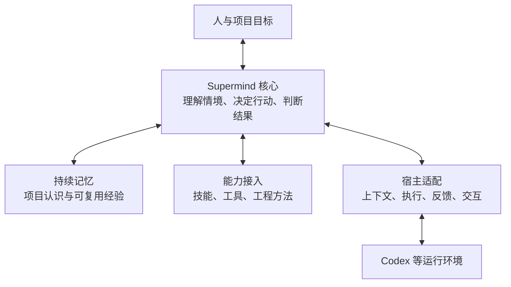
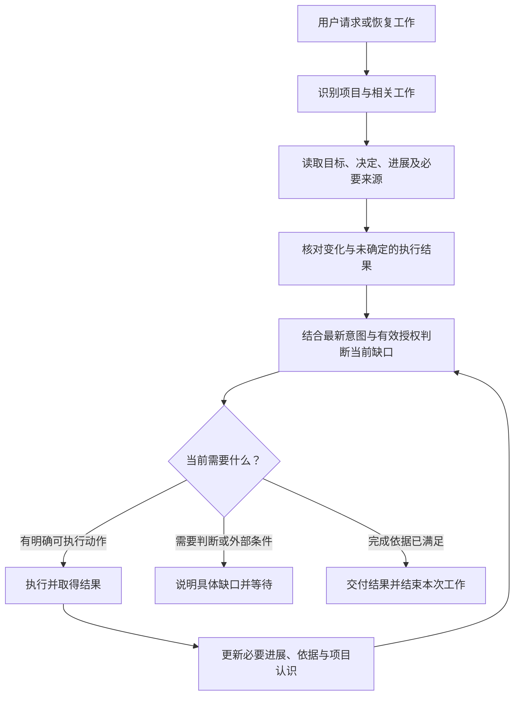

# Supermind 软件项目 Agent：产品与架构方向草案

> 历史记录：本文的独立 Agent、需求分析与设计职责已于 2026-09-09 被[当前定位与工程边界](supermind-decision-model.md)替代，不作为现行执行指引。

最新修正：用户明确认为额外状态管理过重。新增实体、状态协议及同步入口优先的建设路线也已撤回；现行方案见[轻量演进设计](2026-09-08-project-agent-v1-design.md)。下文仅作为讨论历史。

本稿记录 2026-09-08 的重新设计讨论。已确认定位与架构建议分别列出；架构尚待讨论，不表示已经实现或完成运行验证。

本文件仅保留讨论展开过程。用户随后明确纠正：应基于现有记忆及多端同步实现演进。下文独立状态存储、首版仅同机接续和另设数据根等建议已撤回；当前方案见[基于现有实现的演进设计](2026-09-08-project-agent-v1-design.md)。正文中的历史建议不能作为实施依据。

## 已确认的产品定位

Supermind 是一个具有持续记忆、长期对软件项目结果负责的独立 Agent，可挂载于 Codex 等宿主运行。

- 服务范围主要是软件项目。
- 工作跨越多次任务，项目认识、有效决定和实际结果需要延续。
- 现有记忆基础是继续建设的起点。
- 独立 Agent 产品与挂载 Codex 可以同时成立。

“对结果负责”体现为理解目标、主动推进、检查实际结果、如实说明缺口，并在重要取舍处与人协作。它不代表保证所有目标成功，也不意味着长期目标自动授权无限执行。

## 现有基础与需要补齐的连接

本轮依据工作区源码和文档静态梳理，未运行测试；工作区已有其他未提交修改，本稿不改变这些文件。

| 现有部分 | 当前载体与边界 | 新架构中的位置建议 |
| --- | --- | --- |
| 核心决策 | 技能入口及 core-decision 指引，指导宿主 AI 判断下一步 | Agent 核心的决策原则 |
| 生命周期与场景 | 场景条件、行动要求、能力检索时点 | 软件项目领域知识与行动依据 |
| 产品认识 | product-state 指引及各项目已有需求、设计和产品资料 | 项目记忆的事实来源与维护规则 |
| 能力记忆 | 独立 Python 包和 CLI；现有模型覆盖能力、证据、关系、需求与使用结果，并有事件历史、检索及同步实现 | 跨项目能力与经验记忆 |
| 技能与工具 | 根据当前问题选择并调用 | Agent 可使用的专业能力 |
| Codex 插件 | 技能分发与工具启动入口 | 首个宿主接入方式 |

现有能力记忆的需求记录主要服务能力匹配，不能直接等同于完整项目需求管理。项目目标、任务接续、执行中断恢复与多会话协调，也不能仅凭能力记忆已有事件历史就宣称具备。后续设计需逐项核对已有载体，补齐必要连接。

## 建议的总体结构

按职责划分，暂不决定拆成多少进程、服务或软件包。

### Agent 核心

核心每次处理用户输入、执行反馈或恢复请求时，回答五个问题：当前目标是什么；相关事实是什么；还缺什么；当前授权下应采取什么行动；依据什么判断结果足够。

核心维护可接续的工作信息：所属项目、本次目标、完成依据、相关决定、授权范围、当前进展、结果证据和未决事项。只保留后续工作必要的信息，引用已有产品资料与代码，不为每次工具调用复制一套文档。

生命周期帮助理解工作背景，场景与方法提供行动依据。决策循环可以随着新事实改变方向，也允许讨论、调查或设计构成本次完整结果。

### 持续记忆

在现有记忆基础上明确三种用途，不预设需要三个数据库：

- 项目认识：目标、范围、有效决定、约束、现行成果与未解决问题。优先沿用所属项目的权威资料。
- 工作接续：本次推进到哪里、发生了什么、是否存在未确认的执行结果、恢复前需要核实什么。
- 可复用经验：现有能力库及其来源、适用边界、证据与使用反馈。

记忆需要区分用户已确认的决定、实际观察、待验证判断和已经失效的信息。恢复任务时重新核对受影响事实；旧记忆帮助寻找依据，不能覆盖更新后的代码或用户决定。

项目私有信息保留在所属项目范围。跨项目沉淀继续遵循现有抽象与确认要求，不能因 Agent 化而把项目过程自动转入共享能力库。

### 能力接入

核心提出具体需要，能力接入负责找到实际可用的入口、理解适用条件，并取得执行结果。现有技能、工具与工程方法继续发挥作用。

能力返回时要区分成功、失败、结果未知、需要用户输入等情况，并保留结果依据。工具成功只说明某项操作完成，由核心判断它是否满足本次目标。

### 宿主适配

适配层说明当前宿主能提供哪些上下文、执行、交互和恢复能力，将它们连接到 Supermind 的工作方式。宿主原生权限约束始终有效。

Supermind 的项目身份和长期记忆不应以某个 Codex 会话标识作为唯一身份。宿主会话是一次工作的运行位置，项目可以在新会话中恢复。

这里的核心是逻辑职责，不意味着第一版必须有一个独立推理进程。挂载于 Codex 时，模型仍可在 Codex 中执行 Supermind 的决策规则。

## 两种运行方式及建议

| 方式 | 怎样运行 | 收益与代价 |
| --- | --- | --- |
| 宿主承载决策循环 | 宿主中的模型执行 Supermind 规则，连接独立记忆与项目接续能力 | 延续现有基础，接入较小；持续运行与控制能力受宿主限制 |
| Supermind 自行承载决策循环 | 独立运行时掌握推进与恢复，经适配层调用宿主执行能力 | 可更直接管理调度与恢复；需额外建设运行时、模型调用和交互机制，并核实宿主接口 |

建议先明确不依赖宿主的产品职责、记忆归属和接续约定，以第一种方式形成完整使用体验。需要独立调度等能力时，再判断是否增加第二种运行方式。独立产品定位从现在成立，独立常驻进程按实际需求决定。

上述方式是设计选择，不是对 Codex 已开放接口的能力承诺。具体接口与生命周期支持留待接入设计核实。

## 首个完整场景建议

以同一项目中的两次工作检验设计：第一次增加一项功能并交付结果，第二次在新会话中继续发布准备。

1. 第一次工作读取已有项目依据，明确功能目标、范围与完成条件。
2. 在授权范围内完成工作，记录真实结果、关键决定与剩余问题。
3. 新会话识别同一项目，恢复有效认识，并核对实际代码及环境变化。
4. 结合新的发布请求确定本次目标，识别剩余依赖和缺少的授权。
5. 继续推进或提出具体待决问题，用户无需重新讲述已被可靠保留的项目背景。

同时检查三类变化：用户改变了目标时能否调整；代码变化后能否识别旧证据失效；上次执行结果未知时能否先核对而非直接重复操作。后续如支持并发任务，还须设计冲突识别与协调规则，不能把记忆同步等同于执行协调。

## 后续需要明确的设计

项目与工作模型、核心决策、Codex 接入与首版范围的第一轮细化见后文。后续需要确定项目记录的实际载体，并以接入演练检验跨任务体验。

后台主动唤醒、并发执行、自有界面以及其他宿主支持尚未确定，不作为本稿已获确认的功能范围。

## 项目与工作模型：第一轮设计建议

本节细化前述方向，仍是设计建议。记录结构表达必要信息，不意味着已选定数据库、接口或必须填写的用户表单。

### 项目是长期责任对象

项目围绕一个持续的软件产品或系统目标建立，可以关联多个仓库和运行环境，也可以在尚无仓库时存在。项目拥有稳定身份；本地目录、Git 仓库地址和宿主会话都是关联位置，不能单独决定项目身份。移动目录、建立工作树或更换会话不自动创建新项目；复制已有项目开展独立产品时也不能自动共享原项目身份。

项目保留以下最小认识：

| 信息 | 用途 |
| --- | --- |
| 身份与关联位置 | 判断当前工作属于哪个项目，找到相关资料、仓库与环境 |
| 当前目标与范围 | 理解项目服务谁、解决什么问题、当前投入方向和约束 |
| 有效决定与依据 | 区分已经确认的要求、方案建议和待决问题 |
| 已有成果与证据 | 说明真实实现和验证范围，定位对应版本与环境 |
| 正在推进的工作与未决项 | 支持接续、影响判断与后续安排 |

认识可以按需读取和更新，不要求每轮加载全项目。需求、设计和代码继续在已有位置维护；项目认识提供引用、摘要与有效性线索。摘要与来源冲突时回到来源核对，涉及需求冲突时交由有效决定解决，不能只凭文件修改时间裁决。

### 一次工作是有完成边界的推进

一次工作服务于一个明确的近期结果，例如理解一个故障、完成某项设计、交付一个功能或准备一次发布。工作可以跨越多个会话；一个会话也可以先后处理多项工作。宿主会话结束不会自动把工作标为完成。

| 必要信息 | 说明 |
| --- | --- |
| 工作身份与所属项目 | 接续时找到同一项工作；拆分后的工作保留关联 |
| 当前意图与完成条件 | 明确当前要交付什么，以何种依据结束 |
| 适用范围与授权依据 | 引用已获得的授权，包括对象、环境和限制；有效授权跨会话沿用 |
| 当前成果与进展 | 区分已经完成的部分、尚待验证的部分与剩余缺口 |
| 相关决定与依赖 | 关联必要的项目资料、其他工作和外部条件 |
| 运行状况与接续提示 | 是否正在执行、等待什么、哪些结果未知、下一步需核实什么 |

只为有独立结果或确有接续需要的工作保留记录。简短解释和常规工具调用不逐一变成长期工作条目；AI 负责维护，用户无需手动录入这些字段。

工作有一个主要所属项目；跨项目活动可关联多个项目的具体工作，不能因此混合各项目的私有记忆。

### 目标、进展与执行分别表达

工作进展采用足以指导行动的少量状态：可推进、推进中、等待、已完成、已终止。等待需说明是用户判断、外部依赖还是主动暂停；已终止保留取消或被替代的原因。恢复时重新核实推进中的执行是否仍然存在。

执行动作另外记录已发起、成功、失败或结果未知。仅在有跨会话接续价值或会改变外部状态时持久保留动作信息，包括目标对象、输入版本、执行标识、结果及证据位置。宿主中断、超时或没有返回，均不能单独证明动作失败。

工作完成依据是约定结果得到满足并具备所需证据。某个动作失败后，工作可能仍可通过其他路径推进；某个动作成功后，工作也可能仍有缺口。完成状态与真实环境需要同时核对。

用户修改同一结果的细节时，修订现有工作并保留变化依据；目标已经换成不同结果时，终止或暂停旧工作，建立有来源关系的新工作。中途提问通常只补充讨论，不自动取消正在推进的目标。无法从上下文判断且会影响执行时，再询问一个聚焦问题。

### 接续协议

恢复只核对与当前行动相关的变化。代码更新并不使全部历史证据失效；需要判断受影响行为、依赖和环境。尚未提交的本地修改也属于当前事实，不能只比较提交标识。

对结果未知的动作，先查询实际状态。若已有执行标识，利用它定位结果；存在防重复机制时在原机制内恢复。对缺少安全恢复方式且会产生重复外部影响的动作，保留未知结果、说明具体缺口，不能无依据重发。只读调查和不依赖该结果的授权工作可以继续。

后续支持并发时，工作应有明确的执行归属与冲突检测；第二个会话不能仅因为读到了同一条工作记录就并行接管。首版接续体验不据此承诺并发调度。

### 更新时点与存储边界

有意义的意图变化、关键决定、成果产生、重要动作发起与返回、进入等待以及交付时，更新必要记录。恢复信息随这些事件保存，减少对会话结束回调的依赖。会话结束回调是否可用尚待核实。

项目事实与工作记录归属于项目，具体存储载体待接口设计确定。现有能力库继续负责共享经验；能力库的需求观察、能力生命周期与 Git 同步不直接充当项目工作记录、工作状态或执行锁。

已有记忆实现中的事件记录、重建、检索等机制可以作为后续评估对象，但本稿不决定将项目记录直接写入现有能力库，也不承诺无需迁移即可支持新增实体。

### 场景推演与完成标准

以下为设计推演，不是已执行的验证。

| 情境 | 预期行为 | 不应发生的结果 |
| --- | --- | --- |
| 功能开发结束，新会话要求准备发布 | 创建或恢复发布工作，引用功能成果，核对发布条件与授权 | 把功能开发完成直接当作发布完成 |
| 实施中用户要求先讨论另一种设计 | 暂停依赖原设计的动作，沿用项目事实开展讨论 | 继续写入已经失去依据的方案 |
| 新会话发现相关代码已改变 | 识别影响，补核受影响的依据与结果 | 重跑所有验证或完全信任旧证据 |
| 部署请求发出后会话中断 | 先识别部署目标和实际执行结果，再决定接续动作 | 把未收到响应当作未部署并直接重发 |
| 当前工作因一个外部条件等待 | 记录具体等待原因，说明可继续的独立范围 | 宣称整个项目完成或擅自扩展工作范围 |

该模型的完成标准是用户能够在新会话中接续同一项目的工作，并得到符合当前事实、目标和授权的行动；仅保存一份摘要或成功读取记录不足以证明达成。

## 核心决策：从项目认识到下一步行动

本节延续现有核心决策指引，增加长期项目责任与跨会话接续所需的判断。以下是产品行为建议，尚未接入分发技能或独立运行时。

### 两个尺度的判断

项目尺度关注当前投入方向、工作之间的依赖和新问题的影响；工作尺度关注如何取得已经明确的近期结果。两者共享项目认识，但不在每次工具调用后重新评估整个项目。

用户明确要求处理某项工作时，先推进该项工作。只有新事实使目标失去依据、暴露相关重大问题或形成实际阻碍时，才上升到项目尺度判断。收到“接下来做什么”时，可结合项目目标比较后续工作；给出建议与获得执行授权分别处理。

长期负责使 Agent 能主动发现并提出下一步，不自动赋予它执行全部待办的权力。本次工作已经完成时应交付；只有已有更大范围目标与有效授权时才连续推进下一项依赖工作。

### 判断输入

核心按需组合当前意图、有效项目决定、相关事实、工作进展、执行反馈、可用能力与授权限制。输入须能区分来源：用户决定、工具观察、历史记录和模型推测。推测不能自动升级成事实；查到某项技能或读到仓库内容也不构成用户授权。

依据来自冲突资料时，首先判断冲突是否影响下一步。对能直接调查的事实先调查；对会改变用户结果的价值取舍准备具体选项。没有影响的历史差异不应阻止常规工作。

### 用目标缺口组织行动

缺口指当前事实与本次完成条件之间尚未满足的部分。一个缺口可以有多种行动路径，行动也可以同时解决多个缺口。

| 缺口 | 合适的行动 | 应取得的结果 |
| --- | --- | --- |
| 对目标存在会影响结果的不同理解 | 读取已有决定，必要时澄清关键选择 | 足以继续的目标与范围 |
| 事实不足或相互矛盾 | 读取代码、资料、日志或实际状态 | 能支撑下一步的事实及不确定性边界 |
| 目标明确，路径尚未确定 | 比较具体方案与取舍 | 当前范围内有依据的行动路径 |
| 缺少合适能力或命中检索条件 | 按现有规则检索、评估与取得必要确认 | 实际可使用的能力或明确的未满足需求 |
| 方案明确，结果尚未形成 | 执行已授权的实现或其他产出动作 | 与目标相关的成果 |
| 已有成果但证据不足 | 按约定补齐相关验证，或交付待人工验证内容 | 对完成条件的真实判断 |
| 依赖尚未满足 | 调查可解决的依赖，准备具体判断或等待条件 | 可继续的范围和明确的阻碍 |
| 完成条件均已满足 | 交付结果并更新必要项目认识 | 本次工作结束，后续可接续 |

该表用于帮助模型选择行动，不要求按表的顺序逐项执行。简单工作可以直接产生结果，复杂工作可以形成计划；计划保存目标、依赖与近期步骤，并随事实变化修订。

### 多个可选动作时如何选择

先排除不满足授权、前置条件或宿主能力边界的动作；剩余动作按对当前目标的实际作用比较：

1. 优先处理会使后续工作失去依据的冲突，以及执行前必须消除的未知结果。
2. 优先解决阻碍当前目标的关键依赖。
3. 在都能推进目标的路径中，比较预期进展、获得有效信息的价值、执行成本及错误后的恢复成本。
4. 缺少足够事实支持高成本改动时，先做能影响决策的小范围调查或试验。
5. 当前动作成本明显超过剩余价值时，说明依据并调整路径；改变用户承诺的范围仍需相应判断。

不引入未经校准的统一分数，不以调用次数、产出文档数或使用能力数衡量进展。选择适当大小的动作以便取得有用反馈；不把所有动作压成最小步骤，也不在依据尚不稳定时连续执行大量依赖步骤。

### 每次决策形成什么

一个可执行的决定应能说明：当前要解决的缺口、拟采取的行动、相关对象与边界、已有依据和授权、预期取得的结果，以及什么反馈会改变路径。

只持久记录会影响后续工作的关键决定、理由摘要与证据引用。常规工具调用沿用当前决定连续执行，不要求逐项生成决策卡；也不记录或展示模型内部推理链。

将自然语言判断与可检查的执行条件区分：模型理解语义和取舍，工具可以检查真实支持的字段、对象、版本和权限。现有技能指导不能宣称为不可绕过的运行时保障；需要程序强制执行的约束，须在后续宿主或工具接入中明确实现位置。

### 反馈怎样改变下一步

| 得到的反馈 | 核心如何处理 |
| --- | --- |
| 动作成功且填补了缺口 | 更新事实与相关进展，选择剩余必要动作或交付 |
| 动作成功但目标没有更接近 | 检查路径是否选错、输入是否不完整或完成依据是否被误解 |
| 已确认失败 | 根据原因决定修复、换路径或等待，保留真实失败结果 |
| 执行结果未知 | 先核对实际结果；不能将其降格成失败再直接重试 |
| 用户修正目标 | 更新受影响的工作与依赖，保留仍然有效的事实和授权 |
| 新证据推翻先前假设 | 撤回依赖该假设的判断，重新选择受影响的动作 |

同一条件下重复失败、反复读取相同资料却没有新信息、反复改写计划而无新依据，都应触发路径复核。重试必须有可说明的理由，并遵循工具本身的重试边界；适合自动重试的暂时性故障也要有明确次数或时间限制。无法继续时具体说明缺口，不把反复尝试包装成进展。

### 继续、等待与结束

- **继续**：当前目标仍有效，尚有缺口，且存在有依据、已授权、实际可执行的推进动作。
- **调整**：事实或目标发生变化，修订受影响的路径；仍可执行的独立部分继续推进。
- **等待**：当前相关范围确实依赖尚未取得的用户判断、外部条件或被暂停的执行。记录原因与恢复条件，不仅写“等待中”。
- **完成**：本次承诺的结果达到约定完成条件，证据覆盖相应范围，并准确交付限制与剩余事项。
- **终止**：用户取消、目标被替代，或经判断不再继续该工作。保留已产生的成果和终止原因，不标成成功完成。

完成的粒度与请求一致。仅要求设计时，可在交付设计后结束；已实现但尚未完成约定验证的功能不能宣称全面完成。项目仍有后续事项不妨碍本次工作完成，项目长期存在也不要求 Agent 在没有新目标时持续运行。

### 贯穿案例：准备发布

用户在新会话要求“继续准备发布”，已有记忆显示功能开发完成、本地验证通过、尚未发布。

1. 核对本次要求是发布准备还是实际发布，沿用能够确定的既有范围，不重复询问已有授权。
2. 读取相关成果与版本，发现认证模块在上次验证后发生变化。
3. 将“认证行为的旧证据是否仍有效”识别为相关缺口，先检查改动影响。
4. 若行为受到影响，在授权范围内补齐必要验证；无关模块的仍有效证据继续沿用。
5. 验证通过后，准备发布制品与执行条件。用户只要求准备时，交付“已具备哪些条件、还有哪些缺口”；不得把准备完成当成已经发布。
6. 若此前已获同一目标环境的实际发布授权，则可继续发布，并根据真实运行结果判断发布工作是否完成。

该案例展示了记忆参与决策、事实更新路径以及按请求范围结束的关系；属于纸面推演，尚未进行真实运行验证。

## Codex 接入与首版交付建议

本节依据现有插件源码、本机命令帮助及 2026-09-08 查阅的官方说明形成。仅进行了只读核对，没有启动新的 Agent、接入外部服务或执行端到端验证。

### 两个接入方向共用一个 Supermind

**挂载到 Codex：** 用户在 Codex 中使用 Supermind。技能负责让模型理解产品职责和工作方式，工具负责读取与维护 Supermind 的持久状态，Codex 承载模型运行、交互和实际执行。现有插件可以作为这一入口继续演进。官方说明确认技能可按需加载指引、脚本和参考资料，并支持显式或隐式调用；这不构成每轮必定执行的保证。[技能说明](https://learn.chatgpt.com/docs/build-skills)

**在 Supermind 产品内使用 Codex：** 如果后续建设自己的界面或运行控制，Supermind 可以评估通过 Codex App Server 接入会话、审批交互和执行事件。官方提供会话创建、恢复及读取接口；本机也存在 app-server 命令，但帮助中标为实验性。具体版本兼容与运行行为须在实施前验证。[App Server 说明](https://learn.chatgpt.com/docs/app-server)

两种方向改变交互和运行位置，不改变项目身份、记忆归属、工作完成条件及核心原则。同一项工作在任一入口恢复时，都应使用同一份项目依据。未来同时支持两种入口时，仍须处理执行归属，不能同时接管同一项工作。

### 首版在 Codex 中的一次实际运行

1. **进入。** 用户明确调用 Supermind；隐式匹配可作为便利入口。首版验收以显式调用为确定入口，不把隐式匹配当作全局常驻保证。
2. **关联。** 根据已有项目关联识别项目，并结合请求找到相关工作。没有可靠关联或存在多个候选时，先定位事实，只有影响身份选择时再询问用户。
3. **恢复。** 读取必要的项目认识、进展、有效授权和结果证据，核对与当前请求相关的实际变化。
4. **推进。** 模型执行 Supermind 的核心决策，通过当前可用工具产生结果；工具调用仍受宿主权限约束。
5. **保存。** 在关键决定、成果、等待和交付时更新必要状态。对需要可靠恢复的重要动作，先保存动作意图，再执行并记录结果。
6. **交付。** 区分本次成果与尚未满足的条件；新的会话可重新关联并恢复，不依赖旧会话仍然存在。

首版不会因为 Codex 完成一轮输出，就自动将 Supermind 工作标为完成。会话输出可以是进度、待决问题或最终成果，由核心结合完成条件判断。

### Supermind 的最小程序边界

以下是建议的操作职责，尚未定义命令名、传输协议或实现位置：

| 操作职责 | 输入重点 | 输出或持久结果 |
| --- | --- | --- |
| 定位项目 | 用户指定对象、已关联位置和当前环境 | 确定项目、候选或明确的身份缺口 |
| 读取工作上下文 | 项目、工作或当前问题及必要范围 | 相关目标、决定、进展、引用和记录版本 |
| 建立或修订工作 | 目标、范围、完成条件与有效决定依据 | 可接续的工作及变更记录 |
| 保存关键进展 | 工作标识、已读取版本、成果或决定与来源 | 新版本或明确的写入冲突 |
| 记录重要动作 | 目标对象、授权依据、动作标识与结果 | 已发起、成功、失败或结果未知的可恢复记录 |
| 交付工作结果 | 完成条件的对应说明、证据及剩余事项 | 结果记录与准确的工作状态 |

字段完整性、版本冲突和记录是否存在可以由程序检查；证据是否真的支持业务完成仍需模型与适当验证判断。模型填入“已授权”不等于获得授权，记录应引用实际用户决定并保留范围，宿主权限不能由该字段覆盖。

任何状态写入都应有明确成功结果。写入失败时，不宣称接续信息已保存。恢复信息保存失败应暂停依赖可靠记录的重要变更；能够安全进行的只读调查可以继续。

这些操作需要稳定的语义边界，但不要求首版立即发布远程服务。当前 CLI 是已有入口；Codex 也支持通过 MCP 接入工具，具体是否增加 MCP 包装需要结合调用与分发成本决定，本稿不承诺已有 Supermind MCP 服务。[MCP 说明](https://learn.chatgpt.com/docs/extend/mcp?surface=cli)

### 可以保证什么，必须验证什么

| 层次 | 能承担的责任 | 不能据此宣称的能力 |
| --- | --- | --- |
| 模型与技能指导 | 理解意图、选取行动、识别场景、判断完成依据 | 每次都不会遗漏规则或保存动作 |
| Supermind 工具 | 被调用边界内的持久化、读取、结构检查与冲突反馈 | 拦截所有宿主操作、理解全部业务含义 |
| 宿主 | 其实际支持的工具执行、权限、会话与交互能力 | 自动满足 Supermind 的全部生命周期要求 |
| 行为演练与结果核对 | 证明给定场景和版本下的实际表现 | 对所有未来输入和中断时刻作无条件保证 |

若某项外部操作必须具备不可遗漏的动作记录，应将记录与执行放入受控入口，或通过已验证的宿主事件机制实现。仅在技能中写“先记录再执行”不足以保证该顺序。首版验收应明确受控动作范围，对范围外的未知结果只能调查并如实说明。

### 现有实现的演进位置

| 现有资产 | 建议调整 |
| --- | --- |
| 核心决策与协作指导 | 提炼为 Supermind 自有的核心定义；Codex 技能引用或随版本分发，避免另维护一套含义不同的规则 |
| 场景与工程方法 | 保持按需加载，服务软件项目中的具体判断 |
| 独立能力记忆工具 | 保持既有数据与接口边界；评估新增项目接续职责应放在哪里 |
| 插件入口与展示文案 | 在新版架构确认并落实后，更新为独立 Agent 的 Codex 入口 |
| 工具启动器 | 将宿主环境与产品数据位置的选择明确隔离，保持旧数据可定位 |

启动器目前默认以 CODEX_HOME 或 ~/.codex 为数据根，同时支持显式 data-home；这是可见的宿主耦合点。独立产品的数据归属应明确，但不需要立即搬迁已有数据。任何位置调整都需设计发现、迁移、兼容与失败恢复，不在本次草案中直接操作。

### 首版应交付的完整体验

首版建议交付“一个项目中的工作可以在新的 Codex 会话中可靠接续”：保留现有能力记忆与插件入口，建立必要的项目关联和工作记录，连接核心决策，并形成真实行为证据。

| 验收情境 | 应观察到的行为 |
| --- | --- |
| 新会话继续同一项目 | 不要求重述已保留的信息，能定位正确项目与相关工作 |
| 用户改变范围 | 修订受影响目标与行动，沿用仍有效的事实和授权 |
| 成果或代码变化 | 核对相关差异，准确处理旧证据 |
| 重要动作结果未知 | 查询实际结果，避免无依据重复产生外部影响 |
| 状态保存失败或冲突 | 明确失败，不假称保存成功或覆盖更新后的记录 |
| 记忆来源缺失或不可访问 | 说明具体缺口，区分可继续与依赖该来源的工作 |
| 本次完成或等待 | 准确说明状态、成果与下一步条件，新会话能恢复 |

上述行为需要真实运行演练；仅检查文档、数据字段或命令返回不够。首版暂以单项工作顺序执行验证接续，后台调度、并发运行、多宿主切换和自有界面分别作为后续范围判断。

### 当前设计结论与剩余决定

产品定位、逻辑职责、项目与工作模型、核心决策及首版接入路径已形成一份可讨论的整体草案。已确认定位见文首，后续架构内容仍为建议，不把用户要求继续设计视为已批准所有实现细节。

开始实施前还需确定：项目与工作记录的实际载体、首版受控执行的范围、产品数据与现有能力记忆的连接方式，以及真实接入演练的方法。完成这些选择后，再形成按依赖排序的实施计划。

## 信息归属与持久化边界

本节确定建议的信息分工；尚未选定新增存储引擎或实施数据迁移。原则是每类信息有明确的权威来源，其余位置保留引用或可重建的摘要。

### 三类权威信息

| 信息归属 | 保存内容 | 建议载体 | 更新依据 |
| --- | --- | --- | --- |
| 项目成果 | 需求、设计、有效产品决定、代码、测试与发布产物 | 所属项目已有资料、仓库与制品位置；尚无位置的必要文字成果可先保存在项目专属资料区 | 已授权的工作及实际成果 |
| Agent 工作状态 | 项目身份与位置关联、当前工作、目标与完成条件、进展、等待条件、关键动作记录、证据引用 | Supermind 管理的项目专属结构化记录，按项目隔离 | 当前请求、可追溯的用户决定和执行反馈 |
| 可复用能力与经验 | 通用能力、适用范围、来源、验证与复用结果 | 现有能力记忆 | 现有抽象、确认和登记规则 |

这三类信息都参与 Supermind 的记忆，但具有不同的读写与共享边界。采用一个面向任务的读取入口，不要求物理合并为同一个存储库。

现有能力记忆已提供独立工具与持久化基础。代码中的能力证据以 capability_id 关联，需求观察围绕能力匹配组织；不能把任意功能验收或项目待办直接填入这些实体。项目接续记录需要自己的语义模型，底层是否共用现有技术机制留待实现方案评估。

### 正文、引用与摘要

需求和设计正文沿用项目已有位置。工作记录保存所引用对象、相关版本或内容摘要、适用范围及上次核对结果，不复制整篇正文。运行时可按当前问题拼接必要上下文，读取不足时再取得原文。

对需要影响后续工作的用户决定，保留最小充分记录：具体内容、适用范围、来源、确认情况与替代关系。仅有宿主会话标识不足以保证长期可用，必要的决定正文也应在项目范围内持久保存；对话原文无需全部归档。

某个决定成为项目正式需求或设计后，相关记录指向正式位置，并保留历史确认依据。后续修订该决定时同步标记旧依据的适用性，不能让会话摘要和项目正文各自成为“现行版本”。

项目总览、下一步建议、搜索结果和组合上下文均为派生视图。派生视图可以重建，也可能过时；它们不能覆盖原始记录与实际成果。重要判断仍需引用支撑它的事实。

### 项目隔离与宿主关联

项目专属记录默认由 Supermind 的产品数据位置管理，项目仓库中的资料继续沿用原有共享方式。工作记录不自动提交进业务仓库，也不自动同步到跨项目能力库。跨设备传递这些记录需另行确定同步和权限范围；首版同机跨会话接续不承诺跨设备恢复。

稳定项目身份与当前设备上的目录关联分开。记录中的成果引用尽量采用项目内位置和明确版本，宿主适配负责解析为本机路径。复制、分叉、多仓库和同名项目不能仅靠名称自动合并；无法确定关联时保留候选并澄清。

宿主相关信息集中保存宿主类型、会话关联、必要的执行标识与能力情况。核心读取记录不依赖完整 Codex 会话日志，也不把宿主凭据写入项目记忆。认证继续使用实际运行环境支持的机制。

### 一次结果怎样保存

以完成手机号登录为例：

1. 代码和必要的需求、设计变更保存在所属项目。
2. 验证产生实际结果，必要证据保存在可定位的项目或制品位置。
3. 工作记录更新成果引用、覆盖范围、完成情况与剩余事项。
4. 新会话根据引用核对相关成果，恢复当前工作或开始发布准备。
5. 如果产生值得跨项目使用的认证经验，另行抽象与确认后才进入能力库。

这些写入可能跨越多个载体，不假设存在覆盖代码、制品和 Agent 状态的单一事务。成果已产生但状态保存失败时，保留可定位的产物，报告未保存的接续信息；恢复时核对现有成果并补记，不能直接重复实施。

对重要操作采用稳定动作标识，记录执行前的意图与执行后的实际结果。跨记录写入应能够发现不完整状态，按真实产物恢复；记录版本冲突应返回冲突，由调用方核对后再更新，不静默覆盖。

### 从现有版本演进

首版优先新增必要的项目关联和工作记录，保留现有能力库的位置、历史和同步方式。已有项目资料只建立必要引用；仅对当前工作需要的历史信息作有来源的补录，不扫描全部旧会话并自动推断授权。

已有 data-home 入口用于兼容现有部署。产品级数据位置的解析应与 Codex 适配分开，但不能通过改默认路径让旧库失联。迁移如有必要，应在独立方案中展示实际来源、目标、校验与恢复方式。

首版所需的是可定位、可读取、可可靠更新的项目与工作记录。暂不为全部项目内容建立新的向量库，不要求新增常驻服务；后续是否需要，依据检索与接续的实际缺口决定。

### 接续的一致性要求

记录成功必须能够重新读取；未完成写入必须能够识别；引用缺失或版本变化不能伪装成仍然有效；模型总结不能替代用户确认；共享能力库的正常同步不能夹带项目私有过程。

上述要求是后续实现与验收的约束，尚未证明现有程序已经满足。存储引擎、程序包边界和具体接口在这一语义分工上继续设计。

## 首版操作契约与依赖边界

本节把职责收敛为可实现的接口建议。下列名称用于设计讨论，尚不存在对应的新命令或服务；也不表示现有能力记忆协议已被修改。

### 项目接续可以独立启动

当前 capability-memory 的 cli.build_service 会加载向量模型、打开记忆存储并检查仓库配置和健康状态。这适合现有能力检索入口，但读取工作进展不应必须依赖这些操作成功。

建议核心的项目接续入口只依赖项目与工作记录，以及本次需要读取的项目来源。需要能力检索时，再调用现有能力记忆接口；命中必须检索的场景仍遵循原有阻断规则。能力检索失败不能被解释成没有候选，但不依赖该检索的状态读取和已有授权调查不应整体失效。

由此形成三个实际依赖边界：项目与工作状态操作、能力记忆操作、宿主执行。它们可以位于同一发行包中，但初始化不相互强制绑定。

### 对外操作

| 操作组与建议名称 | 语义与关键结果 |
| --- | --- |
| 项目定位：project.resolve | 按已知项目标识或位置关联返回确定项目、候选或未关联；只定位，不自动创建 |
| 项目登记：project.register | 在创建项目身份或确认位置关联的范围内保存项目与来源；需要处理同名和重复请求 |
| 工作读取：work.read | 按项目读取指定工作或候选列表，返回当前修订号与必要引用；无记录和读取失败分别表达 |
| 工作建立：work.open | 为独立近期结果建立工作，记录目标、完成条件、范围与依据；明确依赖其他工作时保留关联 |
| 工作修订：work.revise | 修改目标、范围或完成条件，引用变化依据并保留被替代的修订；不能伪装成进度更新 |
| 保存进展：work.checkpoint | 更新成果、证据、未决项、等待条件与接续提示；不隐式改变已确认目标 |
| 动作准备：action.prepare | 保存重要动作的对象、目的、适用工作修订与授权依据，取得稳定动作标识；返回成功后才进入所声明的受控执行 |
| 动作结果：action.observe | 按动作标识补充观察，区分执行成功、失败与未知；后续查明结果时保留先前未知状态的历史 |
| 工作结束：work.finish | 明确完成或终止，并提供完成条件的对应依据或终止原因；未覆盖的必要完成条件不能通过简单状态写入消失 |

普通进度更新可通过 checkpoint 表达等待或恢复可推进；工作终止或完成通过 finish 表达。仅补充已完成成果的引用可留作记录更正，新增目标或追加实现应建立新工作或显式修订，不能静默把已完成工作改回推进中。

操作读取返回结构化数据，面向用户的自然语言摘要由核心根据结果生成。用户继续通过日常语言表达需求，无需记忆接口名。

### 请求、修订与动作身份

必须区分三种标识：

- 请求标识：识别一次逻辑写入及其重试，由调用方在提交前生成并保留。
- 工作修订号：说明写入或行动依赖的是哪个版本的目标与状态。
- 动作标识：关联执行前记录、实际执行与后续观察，跨请求持续不变。

同一请求标识与同一内容再次提交，应返回原结果；同一标识携带不同内容应报冲突。去重记录需与对应写入在同一持久提交中落定，避免出现“内容已保存，但重试又写了一次”的窗口。重试标识丢失时，先查询已有记录，不直接把重试当作新工作。

修改已有工作携带预期修订号；实际版本已变化时返回冲突与当前版本，调用方核对后重新决定。修订号检查保护记录不被静默覆盖，不等同于执行锁。首版在发现同一工作已有未结束的执行归属时拒绝直接接管，交由恢复流程核实；不会因此宣称支持并发调度。

关键项目决定变化时还需要检查相关依据是否仍适用。工作修订未改变并不能证明项目约束没有变化，受影响动作在执行前须核对它引用的项目依据。

### 返回结果与错误处理

建议返回协议版本、请求标识、操作结果、当前记录修订、数据或结构化错误。操作完成与工作完成分别表达，不把一次成功保存的响应写成“项目已完成”。

| 情况 | 调用方应如何处理 |
| --- | --- |
| 项目未关联或存在歧义 | 返回候选和缺口；依据用户上下文定位，必要时澄清 |
| 记录不存在 | 明确返回不存在；仅在确实需要创建新工作时创建 |
| 修订或重复请求冲突 | 读取已有结果与新版本，判断差异后再提交 |
| 来源不可用 | 标出受影响引用；不依赖它的工作可继续 |
| 持久化失败或数据损坏 | 保留错误，暂停依赖可靠记录的变更；不创建空状态掩盖历史丢失 |
| 写入是否成功尚不确定 | 按原请求标识查询或重试，不产生新逻辑请求 |
| 业务动作结果未知 | 按动作标识查询真实执行，不能因记录操作成功就认定业务动作成功 |

现有能力记忆已经有独立的 ProtocolEnvelope 与操作标识。新接口应在适配边界转换结果，不直接改动现有协议含义；现有每次调用新建的操作标识也不能代替调用方重试去重标识。

### 首版受控范围

首版程序层面保证的对象是 Supermind 自己管理的项目、工作与动作记录：成功可读、重试不重复、冲突可见、未知结果不冒充成功。对宿主工具的任意调用，不承诺已有全局拦截或自动记录。

外部副作用的自动恢复只对已实现并验证了准备、执行、结果查询链路的具体能力成立。首版可以利用可恢复的本地演练动作证明这一模式，实际部署等动作在完成各自接入前仍按事实调查和已有授权处理，不给所有工具统一加上未经验证的“安全重试”标签。

### 交付顺序与完成证据

以下为设计层面的交付分段，不是已授权实施计划。

1. **项目与工作记录闭环。** 完成定位、读取、建立、修订、进展保存与结束语义；在新的进程中读取先前记录，演练重复请求、旧版本写入与写入中断。
2. **Codex 中的真实接续。** 将核心入口连接记录操作；在两个独立会话中完成同一项目的接续，检查目标改向、证据失效与结束范围，不能靠手动复制整段历史制造成功。
3. **重要动作与失败恢复。** 选择明确范围的受控演练动作，覆盖执行前后中断、结果未知和记录保存失败；证明不会无依据重复执行，并检查不支持的动作会准确说明边界。

每段只补齐本段所需验证；最终保留一个贯穿场景的真实记录。能力库既有接口与数据兼容也要检查，但不因新增项目接续而默认重做全部能力检索评测。

### 实施前剩余的集中选择

接口语义和失败边界已明确到可供实现评审的程度。下一步应集中评估项目记录的存储方案与具体演练方式，然后整理完整设计进行评审；不继续以增加概念层数代替这些选择。独立产品的首版成功标准仍是跨会话推进软件项目的实际结果。
